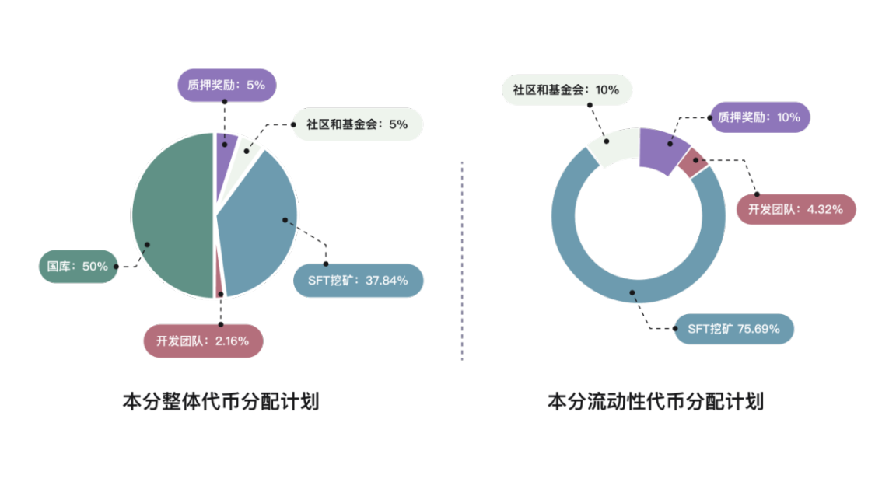

新一代全局抵押稳定币公链 BenFen 于 8 月 1 日宣布正式上线其主网 1.0 版本，并将推出创世用户激励活动。这对于 2024 稳定币赛道新宠 BenFen 来说，是里程碑式的重要时刻，标志着在历经三轮公测，超过 10000 名社区用户支持下，BenFen 将正式起航，在万亿美元的稳定币市场乘风破浪。

<!--truncate-->

BenFen 是基于 Move 语言构建的安全、稳定、高性能、低成本的底层区块链，内置去中心化、锚定多币种的全局抵押稳定币，原生支持稳定币在质押及支付 Gas 等方面的应用。

它由 BenFen 基金会发起，得到了知名区块链集团币信的热心支持，在 4 月币信香港大会上首次亮相。在 4 个月中陆续推出了三轮公测，获得行业内 50 位 KOL 和社区的支持，超过 10000 名用户参与公测活动。

BenFen 还和币信旗下知名 Web3 金融平台 OpenBlock 达成深度合作，与知名硬件钱包品牌 OneKey 共同推出联名款钱包。这一系列的活动和合作，彰显了 BenFen 在行业内的品牌影响力和强大竞争力。

BenFen 提出的全局抵押稳定币全新叙事给行业带来了新的思考和变革，在激烈的竞争中，以创新的全局抵押机制和公平的代币经济分配模型展示了巨大的估值潜力。

BenFen 全局抵押 50% 的代币 BFC，保证稳定币与 BFC 之间可随时兑换。全局抵押模式大大优于目前市场中 1:1 或者 1：N 的抵押方式，理论上无清算风险。

在代币分配模型上，BFC 体现了用户友好和社区驱动的优势，早期未引入风险投资机构。除 50% 的 BFC 永久抵押外，37.84% 的 BFC 由社区用户以 SFT 挖矿形式产出，5% 的 BFC 支持社区贡献者和基金会运营。这意味着 87.84% 的 BFC 处在长期锁定状态，这种代币分配设计，避免了市场上目前所谓的机构抛售，有利于 BFC 长期稳定的上涨。

从公测活动中 BFC 的价格估算,BFC 完全稀释估值（FDV）仅为 1 亿美元。对比 2024 年新上线的稳定币赛道其他项目动辄几十、上百亿美元的 FDV，BenFen 无疑具有巨大的增长潜力。

与大多数采用硬件挖矿的项目不同，BenFen 率先在公链上推出了 SFT 挖矿模式。BenFen 发行的虚拟矿机 Long 以图币合一的 SFT(Semi-Fungible Token) 形式呈现，将 LONG SFT 矿机与 LONG 代币灵魂绑定，始终保证固定的 1:1 兑换比例。将“半同质化”的矿机以同质化代币的方式在 BenFen Station 进行发行，利用同质化代币性质增加二级市场流动性，利用 NFT 的特性进行确权、质押、挖矿生息，使矿机的整体发行与交易成本降低。

BenFen 的全局抵押叙事、公平的代币分配模型及创新的 SFT 挖矿功能在三轮公测中吸引了超过 10000 社区用户的肯定和支持。在主网上线的历史时刻，BenFen 也推出了创世用户特别激励活动回馈参与公测的用户们。

创世用户不仅可以参与早期 Long 挖矿，享受超高的 BFC 收益，而且还将获得额外 10%Long 激励。所有参与公测活动的用户，都有机会成为创世用户，只需要在活动推出第一周率先购买 Long 并质押挖矿两周，官方预计最多给出 1000 个创世用户名额。

随着 BenFen 主网的正式上线，BenFen 丰富的生态应用包括不限于资产跨链、支付、卡和 BenFen ID 也将逐步落地。作为新一代以全局抵押稳定币为核心的去中心化金融平台，BenFen 将为用户、开发者和商家在区块链应用方面创造更多的机会和价值。
