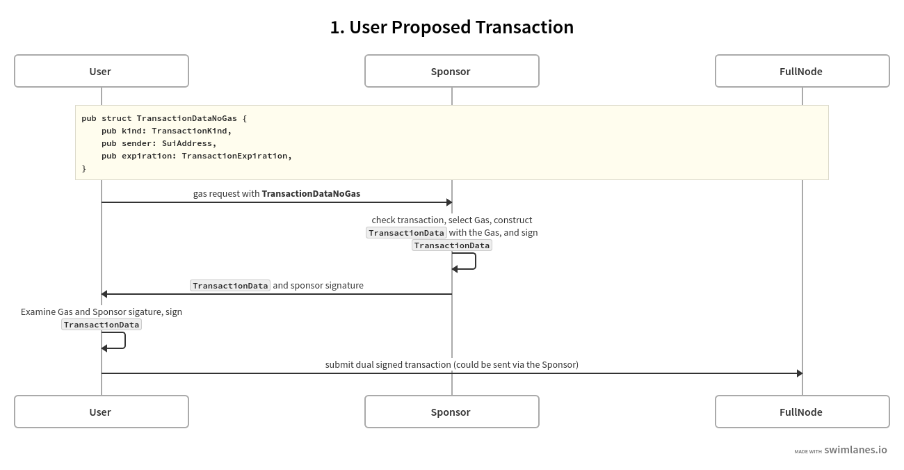
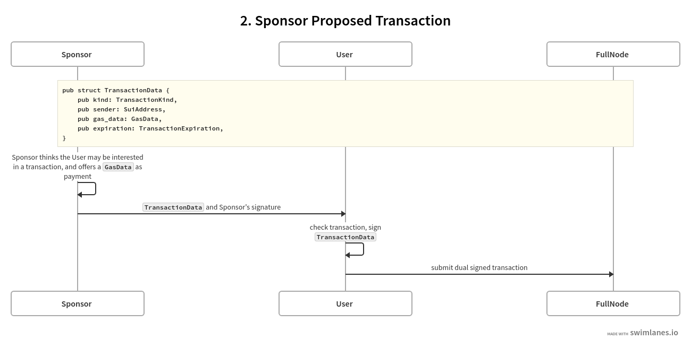
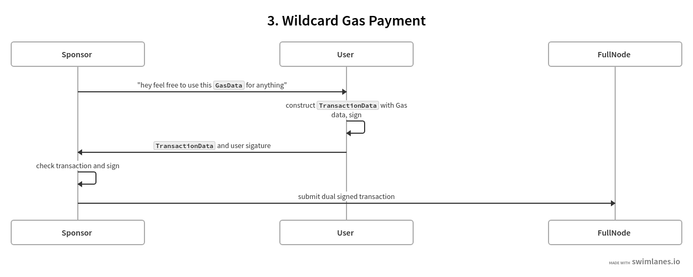

# 赞助交易

赞助交易是 Sui 区块链上的一个原语，无需用户支付 Gas 费用即可执行交易。它还讨论了赞助交易中的角色以及一些常见用例。然后它讨论了赞助交易的流程，主要针对有兴趣建造加油站或与加油站集成的开发人员。最后讨论了赞助交易的风险考虑。

### 概述

Sui 上的交易需要付款才能执行。付款也称为 Gas，是一个 `0x2::coin::Coin<0x2::sui::Sui>` 对象列表，并支付给 Sui 验证者以保护网络。尽管 Gas 是 Sui 代币经济中的关键部分，但当新用户开始在 Sui 上导航时，尤其是 Web 2.0 用户，它有时会带来挑战。

赞助交易可以减少用户的入职摩擦，因为该功能简化了最终用户的流程。使用赞助交易，您可以执行交易而无需用户自行支付。相反，您可以充当交易的赞助商，为交易提供您自己的支付气体对象。

### 赞助交易中的角色​

在赞助交易中存在三个角色：用户、加油站和赞助商。

- 用户是想要执行交易的实体。
- 加油站是通过提供其拥有的汽油付款来满足用户交易的赞助请求的实体。
- 赞助商是为加油站运营提供资金的实体。

加油站和赞助商是同一实体的情况并不罕见。例如，web3 游戏工作室可以运营自己的加油站，在用户获取阶段为用户提供真正的免费游戏体验。因为为任何规模的团队维护加油站并不总是小事，所以游戏工作室还可以利用第三方加油站来赞助他们想要促进的交易。

本指南的其余部分假设赞助商使用他们自己的加油站。

###  使用案例​

以下部分描述了赞助交易提供改进的用户体验的一些常见场景。

### 针对特定应用程序的赞助​

在这种情况下，赞助商有一组他们想要赞助的特定应用程序。

- 如果交易是由用户初始化的，则发起人会检查该交易，以确保它在同意提供 Gas 付款之前位于一组已批准的应用程序之内。
- 如果交易是由发起人提议的，则用户必须检查该交易并决定是否要执行它。这种类型的交易的示例可以包括活动的奖励索取交易或“尝试一下”广告交易。

###  通用赞助​

在这种情况下，发起人对 Gas 支付可用于的交易类型几乎没有限制。

- 如果赞助商是无gas钱包，它可能同意赞助其用户提出的任何有效交易。
- 以奖励或折扣的形式，赞助商可以向用户提供通配符 Gas 付款，明确承诺使用该 Gas 付款执行任何交易。

赞助交易不限于这些用例。本质上，赞助交易是由用户和赞助商共同进行的任何交易。只要利益相关者能够就交易细节达成一致，那么提供赞助交易的可能方式的数量就仅受想象力的限制。然而，由于至少有两个利益相关者参与赞助交易，因此您应该采取措施减轻一些[额外风险](#risk}。

### 赞助交易流程​

本节主要面向有兴趣建造加油站或与加油站集成的开发人员。

交易的数据结构如下所示：

```
pub struct SenderSignedTransaction {
    pub intent_message: IntentMessage<TransactionData>,
    /// A list of signatures signed by all transaction participants.
    /// 1. non participant signature must not be present.
    /// 2. signature order does not matter.
    pub tx_signatures: Vec<GenericSignature>,
}

pub struct TransactionDataV1 {  // <-- A variant of `TransactionData`
    pub kind: TransactionKind,  // <-- This is the actual transaction details
    pub sender: SuiAddress,
    pub gas_data: GasData,
    pub expiration: TransactionExpiration,
}

pub struct GasData {
    pub payment: Vec<ObjectRef>,
    pub owner: SuiAddress,
    pub price: u64,
    pub budget: u64,
}
```

前面的代码需要注意一些细节：

- `TransactionDataV1` 中的 `sender` （ `TransactionData` 的变体）是用户地址。
- `TransactionDataV1` 中的 `gas_data` 是gas费用。
- `GasData` 允许气体对象列表，但相同的地址必须拥有它们，即 `GasData` 中的 `owner` （赞助商）。当 `owner` 等于 `sender` 时，它是常规/非赞助交易。
- `SenderSignedTransaction` 中的 `tx_signatures` 是签名列表。对于赞助交易，列表需要按某种顺序包含用户和赞助商的签名。签名是在整个 `TransactionData` 上签名的，包括 `GasData` 。

因此，要构建正确的赞助交易，您必须首先构建一个 `TransactionData` 对象。如果您既不是用户也不是赞助商，则您可以将交易传递给双方进行签名。如果您是发起人，您将签署交易，然后将其和签名传递给另一方（以 `SenderSignedTransaction` 的形式）供他们签名。在实践中，后者是更常见的情况。

赞助交易有三种流程。

用户提议的交易



赞助商提议的交易



通用 Gas 支付



### 风险考虑​

由于至少有两个利益相关者参与赞助交易，因此您应该采取措施来降低风险。

#### 客户模棱两可的风险​

当多个共享至少一个特定版本的自有对象（例如天然气币对象）的合法交易同时提交到网络时，就会发生客户端模棱两可。在 Sui 上，在执行交易之前，该交易中拥有的对象被锁定在特定版本的验证器上。诚实的验证者只接受一笔交易并拒绝其他交易。根据验证器接收这些交易的顺序，验证器可能会接受不同的交易。如果没有任何一笔交易被至少 2/3 的验证者接受，则拥有的对象将被锁定，直到纪元结束。

实际上，客户端模棱两可的情况很少见，主要是由有缺陷的客户端软件引起的。毕竟，没有人有动力去锁定自己的对象。然而，赞助交易会带来交易对手风险。例如，恶意用户可以通过提交另一笔交易来模糊加油站的加油币对象，该交易使用同一版本的加油站签名交易中的一个拥有的对象。同样，拜占庭加油站可以对用户拥有的对象执行相同的操作。

尽管这种风险看起来微不足道，但意识到这一点是有帮助的。您的加油站应主动监控用户行为并对任何异常情况发出警报。无论您是利用赞助交易的用户还是与加油站集成的开发人员，请考虑您的声誉，以尽量减少客户模棱两可的风险。

用户和发起人都需要签署整个 `TransactionData` ，包括 `GasData` ，否则第三方（例如恶意完整节点）可能会截取部分签名的数据并导致客户端所拥有的对象的模棱两可和锁定。

#### 审查风险​

如果您选择将双签名交易提交给赞助商或加油站而不是完整节点，则该交易可能会受到赞助商或加油站的审查。也就是说，发起人可能选择不向网络提交交易，或者延迟提交。

您可以通过将交易直接提交到完整节点来降低这种风险。
